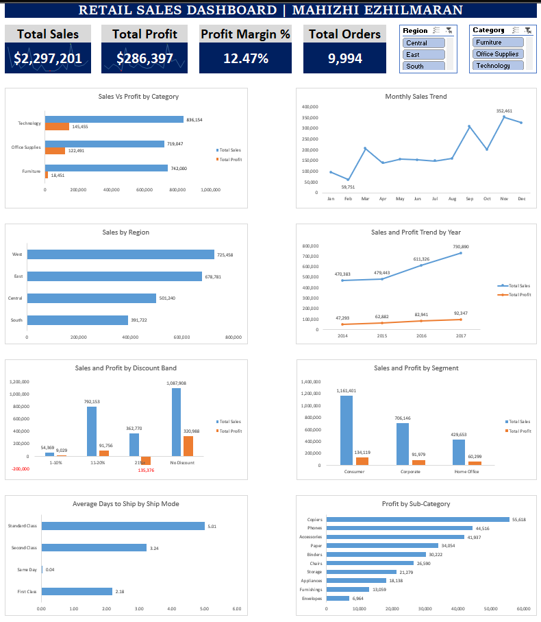

# Retail Sales Dashboard | Superstore (2014–2017)

An interactive Excel dashboard analyzing 9,994 orders from the Superstore retail dataset, built to analyze revenue, profitability, and operational drivers behind the business's performance.

## Problem Statement

The business wants to understand where its sales and profits are actually coming from — by category, region, customer segment and time period — and to identify practices (like discounting and shipping choices) that may be affecting profitability. This dashboard turns 4 years of raw order data into a professional view for that purpose.

## Dataset

- **Source:** Superstore Sales Dataset (Kaggle), 2014–2017
- **Size:** 9,994 orders
- **Fields used:** Order Date, Ship Date, Ship Mode, Segment, Region, Category, Sub-Category, Sales, Profit, Discount, Quantity

## Tools & Skills Used

- Microsoft Excel: PivotTables, PivotCharts, Slicers (linked across multiple pivots), GETPIVOTDATA, SUMPRODUCT, conditional data binning, custom chart theming
- Dashboard design: single-screen layout, consistent color system, KPI cards

## Key Insights

**Profitability**
- Overall profit margin is **12.47%**, well above the typical retail benchmark of ~2–6%, indicating strong operational efficiency.
- Average order value is **~$230** (Total Sales ÷ Total Orders).

**Category Performance**
- **Technology** is the strongest category on both fronts — highest revenue ($836,154) *and* highest profit ($145,455).
- **Furniture** generates high revenue ($742,000) but disproportionately low profit ($18,451, ~2.5% margin) which is of concern. Thin margins here mean a small cost increase could push the category into a loss, and it currently contributes little to justify further investment.
- Digging into sub-categories confirms this: **Bookcases** and **Tables** are both loss-making (-$3,473 and -$17,725 respectively), dragging down Furniture's overall numbers.
- A more hidden risk: **Supplies** (-$1,189) loses money despite sitting inside **Office Supplies**, which is otherwise the second-most profitable category ($122,491, 17% margin) — a loss that's easy to miss at the category level alone.

**Regional Performance**
- **West** leads all regions ($725,458 in sales), outperforming the lowest region, **South** ($391,722), by **85%**.
- West and East show high, profitable sales — strong candidates for continued investment/expansion.
- Central and South lag behind, suggesting a need to invest in marketing, sales enablement, and service coverage to grow demand.

**Seasonality**
- Sales peak in **March, September, and November**, and dip in **February and October** — a pattern consistent with holiday and back-to-school buying cycles.
- Recommended actions for low performing months: targeted discount campaigns, partnerships with local interior designers to reach new audiences, and personalized email/SMS campaigns to the existing customer base.

**Year-over-Year Growth**
- Both sales and profit grew consistently every year from 2014–2017.
- Cumulative growth: **+55.4% in sales** vs **+95.3% in profit** — profit is growing faster than sales, a strong signal of improving operational efficiency rather than just top-line growth.

**Discounting Strategy**
- Discounts of **11–20%** are the most ideal — they drive strong sales ($792,153) while remaining consistently profitable.
- Discounts **above 21%** cause profit to collapse into a **net loss**, as expenses outweigh the discounted revenue. 

**Customer Segments**
- The **Consumer** segment leads in both sales and profit — but it also carries the *lowest* profit margin (11.54%) of the three segments, meaning it underperforms relative to its size. Corporate (13.0%) and Home Office (14.0%) are comparatively more efficient.

**Shipping Operations**
- **Standard Class** is the most-used shipping mode, but it is also the slowest, averaging about **5 days**. This may suit a business selling bulky, high-value items like furniture.

**Sub-Category Extremes**
- **Copiers** are the profit leader ($55,618) — a high-ticket item with strong margins.
- **Envelopes** sit at the bottom ($6,964) — a low-margin commodity product.

## Recommendations

1. Set cap discounts at 20% to protect margins; the 11–20% band is the most effective growth-profit balance.
2. Reassess the Furniture line (especially Bookcases and Tables) — investigate cost structure or consider re-pricing/dropping non-profitable SKUs.
3. Invest in Central and South region marketing and sales capacity to close the gap with West/East.
4. Run targeted campaigns in February and October to even out seasonal dips.
5. Monitor the Consumer segment's profit margin despite its volume leadership.

## Dashboard Preview

**

## How to Use

1. Download `Retail_Sales_Dashboard.xlsx` and open in Excel.
2. Navigate to the **Dashboard** worksheet.
3. Use the **Region** and **Category** slicers to interactively filter the dashboard and explore the data.

## Author

Mahizhi Ezhilmaran
